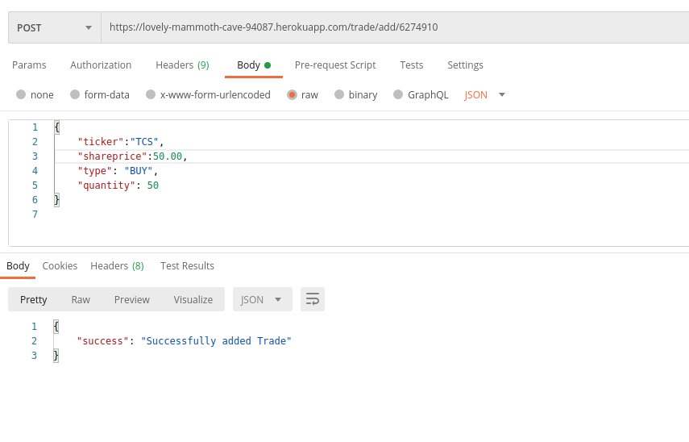
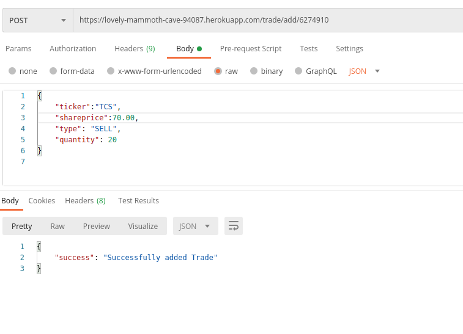
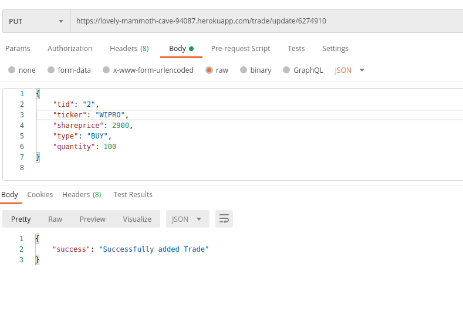
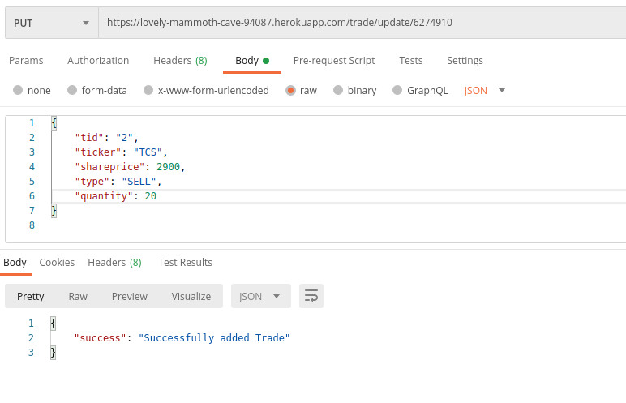

# StockTrackingAPI
A portfolio tracking API needs to be implemented which allows adding/deleting/updating trades
and can do basic return calculations

# User Details
- Name -> Demo
- token -> 6274910 [token -> It is for Security purpose like authentication & authorization]

# Bank Details
We can only BUY/SELL Shares of those company which are register in out Securities.
Currently we have 4 Securities
- TCS -> Tata Consultancy Services Limited 
- WIPRO -> Wipro Limited
- GODREJIND -> Godrej Industries Ltd
- RELIANCE -> reliance digital

# Portfolio Tracking API Requests

# Adding trades 

PART 1 - ​ BUY -> Using this we can add trade of type = BUY

    ● URL-> https://lovely-mammoth-cave-94087.herokuapp.com/trade/add/token
    ● token -> Here we use token to add this trade for particular USER
    ● Body -> Body will contain[ticker,shareprice,type,quantity] you can take reference of Image.
    ● Http Request type -> POST
    
   
   
PART 2 - ​ SELL -> Using this we can add trade of type = SELL

    ● Here Everyting is same as above just type in BODY will change
    
   
   
# Updating a trade
Using this we can update all the fields of a given trade can be updated including trade type

PART 1 - ​ BUY -> Using this we can update trade of type = BUY

    ● URL-> https://lovely-mammoth-cave-94087.herokuapp.com/trade/update/token
    ● token -> Here we use token to add this trade for particular USER
    ● Body -> Body will contain[tid,ticker,shareprice,type,quantity] you can take reference of Image.
    ● Http Request type -> PUT
    
   
   
PART 2 - ​ SELL -> Using this we can update trade of type = SELL

    ● Here Everyting is same as above just type in BODY will change
    
   
