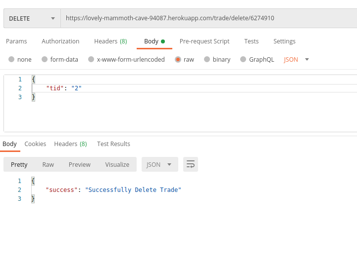
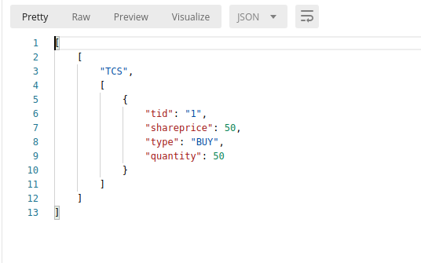
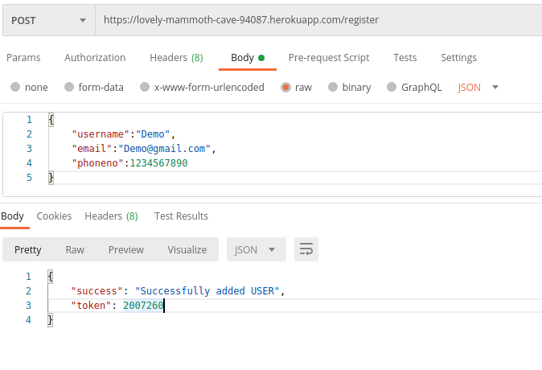

# StockTrackingAPI
A portfolio tracking API needs to be implemented which allows adding/deleting/updating trades
and can do basic return calculations

- Securities: 

        A simple definition of a security is any proof of ownership or debt that has been
        assigned a value and may be sold. Example - Tata Consultancy Services Limited (TCS) one of
        the companies which became public in 2004 and investors can buy and sell shares of TCS.
        Currently price of 1 share (can call it quantity also) of TCS is Rs. 1,843.45. All the information is
        publicly available. Other listed companies - WIPRO (Wipro Limited), GODREJIND (Godrej
        Industries Ltd).

- Ticker Symbol: 

        Every listed security has a unique ticker symbol, facilitating the vast array of
        trade orders that flow through the financial markets every day. Example - ticker for Tata
        Consultancy Services Limited is TCS, for Wipro Limited it is WIPRO.

- Portfolio: 

        A portfolio is a grouping of financial assets such as stocks, bonds, commodities,
        currencies and cash equivalents, as well as their fund counterparts, including mutual,
        exchange-traded and closed funds

# Project Details
- Deployed on -> Heroku.
- Backend -> NodeJS, Express.
- Database -> MongoDB(MongoDB Atlas), Mongoose.
- Project URL -> https://lovely-mammoth-cave-94087.herokuapp.com/ {api request}

# Build and Run Locally
- Install MongoDB, Node on your local machine
- Build API projects by running "npm install"
- Start API by running "node server" or "nodemon server" eg: node app.js
- StockTrackingAPI : http://localhost:3000

# User Details
- Name -> Demo
- token -> 10161144 [token -> It is for Security purpose like authentication & authorization]
- for testing use this tokenID please.

# Bank Details
We can only BUY/SELL Shares of those company which are register in out Securities.
Currently we have 4 Securities
- TCS -> Tata Consultancy Services Limited 
- WIPRO -> Wipro Limited
- GODREJIND -> Godrej Industries Ltd
- RELIANCE -> reliance digital

# Portfolio Tracking API Requests

# Adding trades 

PART 1 - ​ BUY -> Using this we can add trade of type = BUY

    ● URL-> https://lovely-mammoth-cave-94087.herokuapp.com/trade/add/token
    ● token -> Here we use token to add this trade for particular USER
    ● Body -> Body will contain[ticker,shareprice,type,quantity] you can take reference of Image.
    ● Http Request type -> POST
    
   
   
PART 2 - ​ SELL -> Using this we can add trade of type = SELL

    ● Here Everyting is same as above just type in BODY will change
    
   
   
# Updating a trade
Using this we can update all the fields of a given trade can be updated including trade type

PART 1 - ​ BUY -> Using this we can update trade of type = BUY

    ● URL-> https://lovely-mammoth-cave-94087.herokuapp.com/trade/update/token
    ● token -> Here we use token to add this trade for particular USER
    ● Body -> Body will contain[tid,ticker,shareprice,type,quantity] you can take reference of Image.
    ● Http Request type -> PUT
    
   
   
PART 2 - ​ SELL -> Using this we can update trade of type = SELL

    ● Here Everyting is same as above just type in BODY will change
    
   

# Removing a trade
A trade of a security can be removed from the portfolio reverting the changes it had when it was added.

    ● URL-> https://lovely-mammoth-cave-94087.herokuapp.com/trade/delete/token
    ● token -> Here we use token to add this trade for particular USER
    ● Body -> Body will contain[tid] you can take reference of Image.
    ● Http Request type -> DELETE
    
   

# Fetching trades
It will give all the securities and trades corresponding to it

    ● URL-> https://lovely-mammoth-cave-94087.herokuapp.com/trade/details/token
    ● token -> Here we use token to add this trade for particular USER
    ● Http Request type -> GET
    ● Here response is in HTML format you can convert into JSON[Take ref. second picture]
    
   
   

# Fetching portfolio
It is an aggregate view of all securities in the portfolio with its final quantity and average buy price

    ● URL-> https://lovely-mammoth-cave-94087.herokuapp.com/portfolio/token
    ● token -> Here we use token to add this trade for particular USER
    ● Http Request type -> GET
    
   
   
# Fetching returns
This API call respond with cumulative returns at any point of time of a particular portfolio. Formula for calculating
cumulative returns is SUM((CURRENT_PRICE[ticker] - AVERAGE_BUY_PRICE[ticker]) * CURRENT_QUANTITY[ticker])
    
    ● URL-> https://lovely-mammoth-cave-94087.herokuapp.com/returns/token
    ● token -> Here we use token to add this trade for particular USER
    ● Http Request type -> GET
    
   

# Extra Features

# RESET API
This API call will delete all the data of user,trades,banks etc.After this you can create new user,trades,banks. 
    
    ● URL-> https://lovely-mammoth-cave-94087.herokuapp.com/delete
    ● Http Request type -> DELETE
    
   

# Create User

This API call will create a new user in database & return tokenID.Only used when you RESET API.
    
    ● URL-> https://lovely-mammoth-cave-94087.herokuapp.com/register
    ● Body -> Body will contain[username, email, phoneno] you can take reference of Image.
    ● Http Request type -> POST
    
   
   
    ● Token ID -> This ID is very important it is unique for every user only with this Token ID you can perform API calls.
    
   

# Create/Add Bank
This API call will create Securities(Banks). 
    
    ● URL-> https://lovely-mammoth-cave-94087.herokuapp.com/bank/add
    ● Body -> Body will contain[bankname, shareprice, ticker] you can take reference of Image.
    ● Http Request type -> POST
    
   
